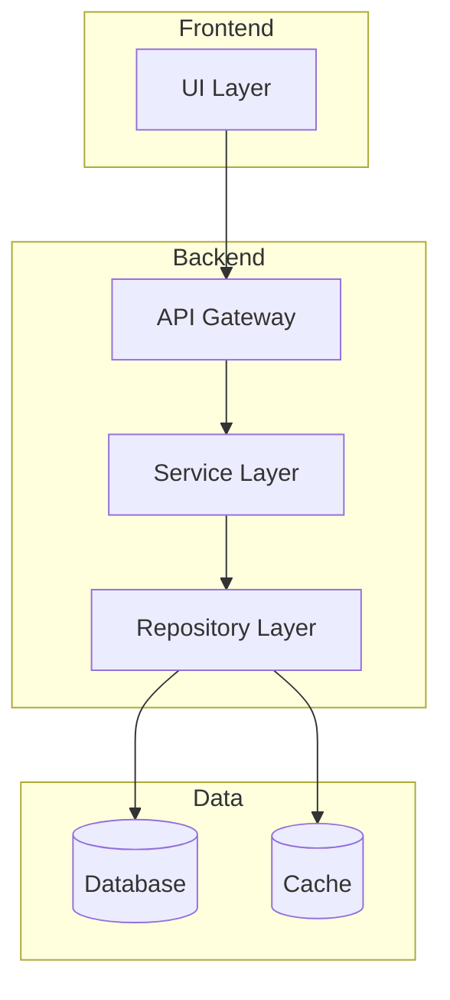
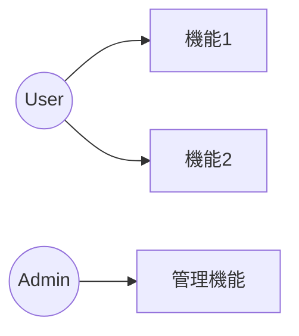
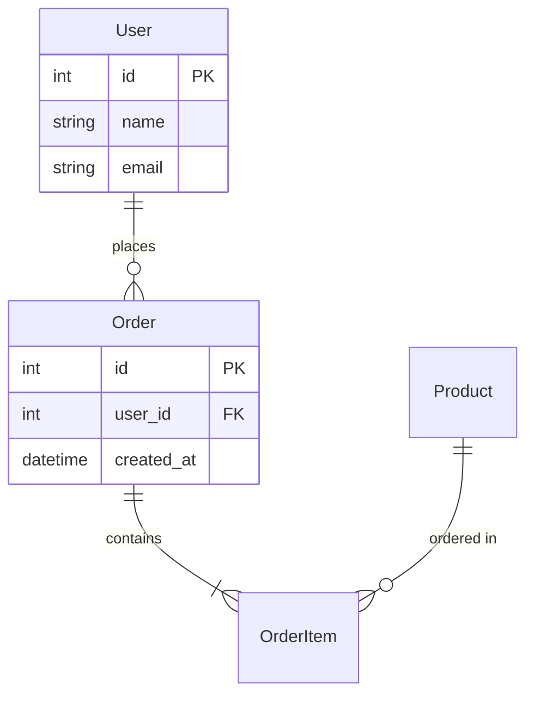
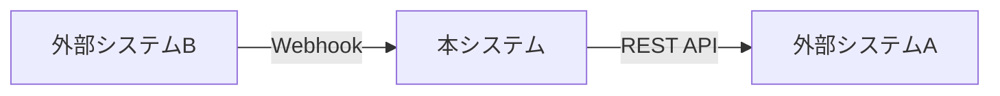
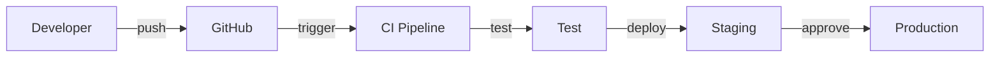

# 基本設計書テンプレート

## 使用方法

このテンプレートをGeminiに渡し、コードベース分析結果を基に各セクションを埋めさせる。

---

# {プロジェクト名} 基本設計書

**バージョン**: 1.0
**作成日**: {生成日}
**生成ツール**: Doc Generator (Repomix + Codex + Gemini)

---

## 1. システム概要

### 1.1 目的・背景

{システムの目的と開発背景を記述}

### 1.2 スコープ

| 区分 | 内容 |
|------|------|
| 対象範囲 | {含まれる機能} |
| 対象外 | {含まれない機能} |

### 1.3 用語定義

| 用語 | 定義 |
|------|------|
| {用語1} | {定義} |
| {用語2} | {定義} |

---

## 2. システムアーキテクチャ

### 2.1 アーキテクチャパターン

{採用しているアーキテクチャパターンと選定理由}

### 2.2 システム構成図

### 2.3 技術スタック

| レイヤー | 技術 | バージョン | 選定理由 |
|----------|------|------------|----------|
| フロントエンド | {技術名} | {ver} | {理由} |
| バックエンド | {技術名} | {ver} | {理由} |
| データベース | {技術名} | {ver} | {理由} |
| インフラ | {技術名} | {ver} | {理由} |

---

## 3. 機能一覧

### 3.1 機能概要

| ID | 機能名 | 説明 | 優先度 |
|----|--------|------|--------|
| F001 | {機能名} | {説明} | 高/中/低 |
| F002 | {機能名} | {説明} | 高/中/低 |

### 3.2 ユースケース図

### 3.3 機能詳細

#### F001: {機能名}

| 項目 | 内容 |
|------|------|
| 概要 | {概要説明} |
| 入力 | {入力データ} |
| 出力 | {出力データ} |
| 前提条件 | {前提条件} |
| 事後条件 | {事後条件} |

---

## 4. データ設計

### 4.1 概念データモデル

### 4.2 主要エンティティ

| エンティティ | 説明 | 主要属性 |
|--------------|------|----------|
| {Entity1} | {説明} | {属性リスト} |
| {Entity2} | {説明} | {属性リスト} |

---

## 5. 外部インターフェース

### 5.1 外部システム連携

| 連携先 | 方式 | 用途 |
|--------|------|------|
| {システム名} | REST API / GraphQL / gRPC | {用途} |

### 5.2 連携図

---

## 6. 非機能要件

### 6.1 性能要件

| 項目 | 要件 |
|------|------|
| 応答時間 | {要件} |
| スループット | {要件} |
| 同時接続数 | {要件} |

### 6.2 可用性

| 項目 | 要件 |
|------|------|
| 稼働率 | {99.9%等} |
| 計画停止 | {メンテナンス時間} |
| 障害復旧 | {RTO/RPO} |

### 6.3 セキュリティ

| 項目 | 対策 |
|------|------|
| 認証 | {方式: JWT, OAuth等} |
| 認可 | {方式: RBAC等} |
| 通信 | {HTTPS, TLS1.3} |
| データ保護 | {暗号化方式} |

---

## 7. 開発・運用方針

### 7.1 開発環境

| 環境 | 用途 | URL |
|------|------|-----|
| Development | 開発 | {URL} |
| Staging | 検証 | {URL} |
| Production | 本番 | {URL} |

### 7.2 CI/CD

---

## 8. リスク・課題

### 8.1 技術的リスク

| ID | リスク | 影響度 | 対策 |
|----|--------|--------|------|
| R001 | {リスク内容} | 高/中/低 | {対策} |

### 8.2 技術的負債

| ID | 内容 | 優先度 | 対応方針 |
|----|------|--------|----------|
| TD001 | {負債内容} | 高/中/低 | {対応方針} |

---

## 付録

### A. 参考資料

- {資料名とリンク}

### B. 変更履歴

| 日付 | バージョン | 変更内容 | 担当者 |
|------|------------|----------|--------|
| {日付} | 1.0 | 初版作成 | Doc Generator |
