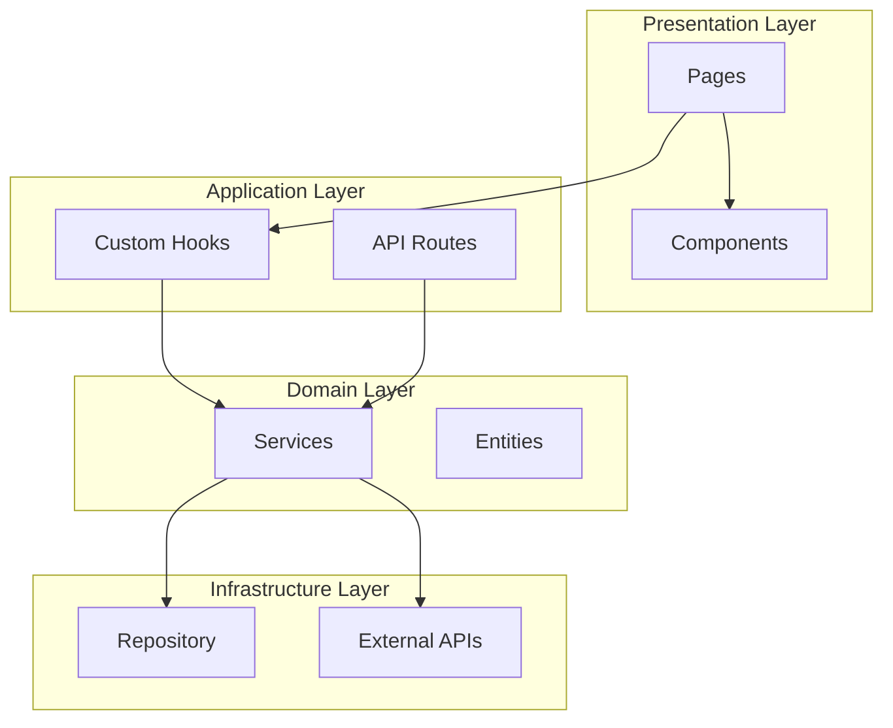
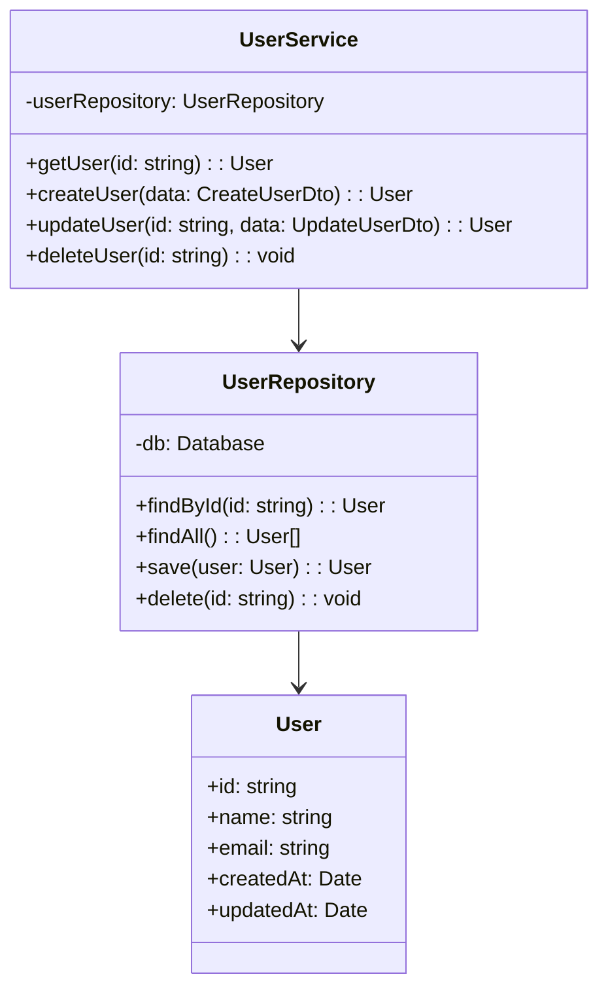
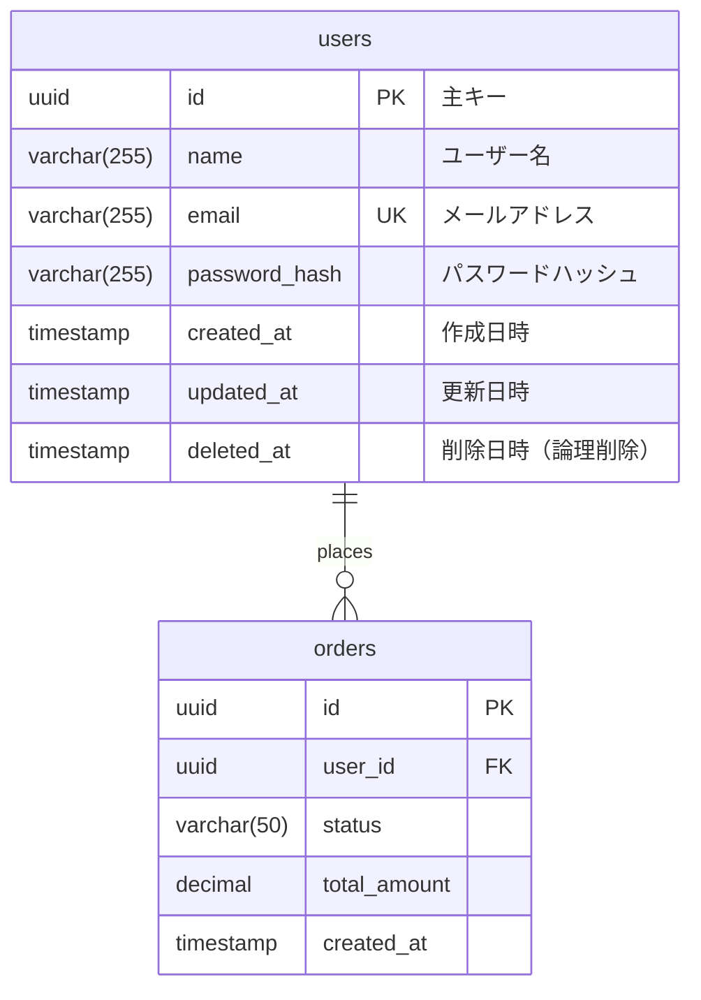
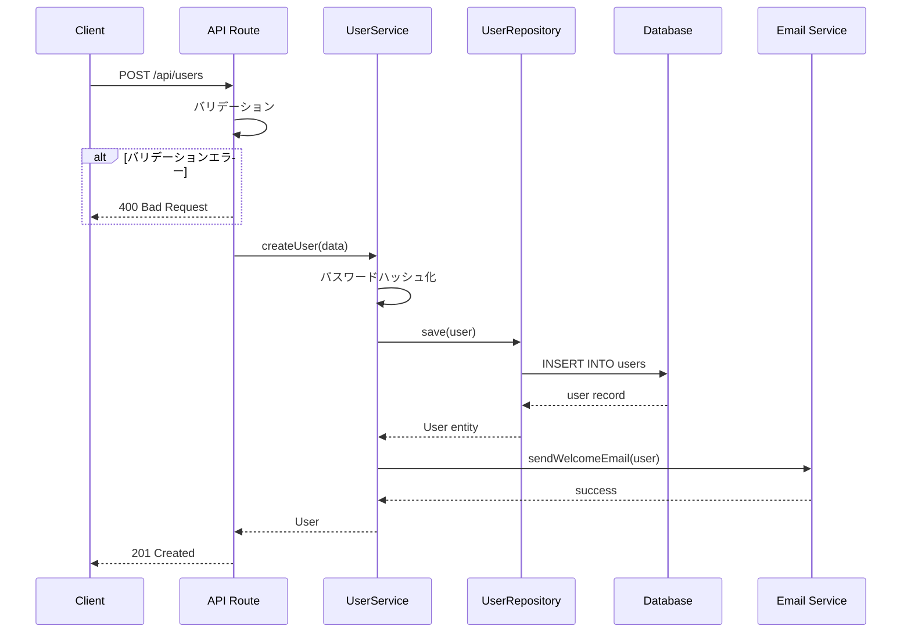
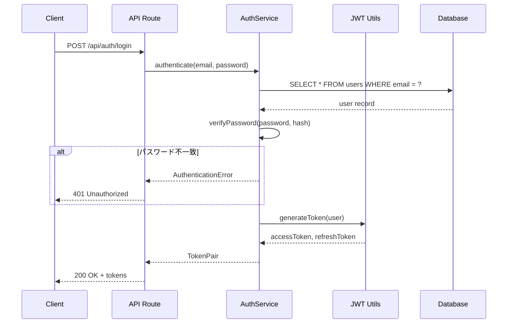
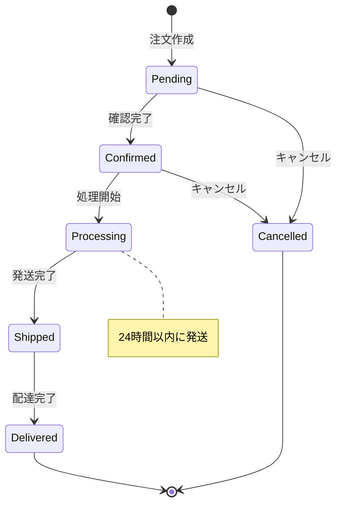

# 詳細設計書テンプレート

## 使用方法

基本設計書の内容を踏まえ、実装レベルの詳細を記述する。

---

# {プロジェクト名} 詳細設計書

**バージョン**: 1.0
**作成日**: {生成日}
**関連文書**: 基本設計書 v1.0

---

## 1. モジュール構成

### 1.1 ディレクトリ構造

```
src/
├── app/                    # Next.js App Router
│   ├── (auth)/            # 認証関連ページ
│   ├── api/               # APIルート
│   └── [feature]/         # 機能別ページ
├── components/            # UIコンポーネント
│   ├── ui/               # 共通UI（shadcn/ui）
│   └── features/         # 機能別コンポーネント
├── lib/                   # ユーティリティ
│   ├── db/               # データベース関連
│   ├── api/              # API クライアント
│   └── utils/            # ヘルパー関数
├── hooks/                 # カスタムフック
├── types/                 # 型定義
└── constants/             # 定数
```

### 1.2 モジュール依存関係



---

## 2. クラス・モジュール設計

### 2.1 クラス図



### 2.2 モジュール詳細

#### {ModuleName}

| 項目 | 内容 |
|------|------|
| ファイルパス | `src/lib/{module}/index.ts` |
| 責務 | {責務の説明} |
| 依存 | {依存モジュール} |

**メソッド一覧**

| メソッド | 引数 | 戻り値 | 説明 |
|----------|------|--------|------|
| `methodName` | `arg: Type` | `ReturnType` | {説明} |

**コード例**

```typescript
export class ModuleName {
  constructor(private dependency: Dependency) {}

  async methodName(arg: ArgType): Promise<ReturnType> {
    // 実装
  }
}
```

---

## 3. データベース詳細設計

### 3.1 ER図（物理）



### 3.2 テーブル定義

#### users テーブル

| カラム名 | 型 | NULL | デフォルト | 説明 |
|----------|-----|------|------------|------|
| id | UUID | NO | gen_random_uuid() | 主キー |
| name | VARCHAR(255) | NO | - | ユーザー名 |
| email | VARCHAR(255) | NO | - | メールアドレス（一意） |
| password_hash | VARCHAR(255) | NO | - | bcryptハッシュ |
| created_at | TIMESTAMP | NO | CURRENT_TIMESTAMP | 作成日時 |
| updated_at | TIMESTAMP | NO | CURRENT_TIMESTAMP | 更新日時 |
| deleted_at | TIMESTAMP | YES | NULL | 論理削除日時 |

**インデックス**

| インデックス名 | カラム | 種類 | 用途 |
|----------------|--------|------|------|
| users_pkey | id | PRIMARY | 主キー |
| users_email_key | email | UNIQUE | メール重複防止 |
| users_deleted_at_idx | deleted_at | INDEX | 論理削除フィルタ |

**DDL**

```sql
CREATE TABLE users (
    id UUID PRIMARY KEY DEFAULT gen_random_uuid(),
    name VARCHAR(255) NOT NULL,
    email VARCHAR(255) NOT NULL UNIQUE,
    password_hash VARCHAR(255) NOT NULL,
    created_at TIMESTAMP NOT NULL DEFAULT CURRENT_TIMESTAMP,
    updated_at TIMESTAMP NOT NULL DEFAULT CURRENT_TIMESTAMP,
    deleted_at TIMESTAMP
);

CREATE INDEX users_deleted_at_idx ON users(deleted_at);
```

---

## 4. API詳細設計

### 4.1 API一覧

| エンドポイント | メソッド | 認証 | 説明 |
|---------------|----------|------|------|
| `/api/users` | GET | 必要 | ユーザー一覧取得 |
| `/api/users` | POST | 不要 | ユーザー作成 |
| `/api/users/:id` | GET | 必要 | ユーザー詳細取得 |
| `/api/users/:id` | PUT | 必要 | ユーザー更新 |
| `/api/users/:id` | DELETE | 必要 | ユーザー削除 |

### 4.2 API詳細

#### GET /api/users

**リクエスト**

| パラメータ | 型 | 必須 | 説明 |
|-----------|-----|------|------|
| page | number | No | ページ番号（デフォルト: 1） |
| limit | number | No | 取得件数（デフォルト: 20） |
| search | string | No | 検索キーワード |

**レスポンス**

```json
{
  "data": [
    {
      "id": "uuid",
      "name": "string",
      "email": "string",
      "createdAt": "ISO8601"
    }
  ],
  "pagination": {
    "page": 1,
    "limit": 20,
    "total": 100,
    "totalPages": 5
  }
}
```

**エラーレスポンス**

| コード | 説明 | レスポンス |
|--------|------|------------|
| 401 | 認証エラー | `{"error": "Unauthorized"}` |
| 500 | サーバーエラー | `{"error": "Internal Server Error"}` |

---

## 5. シーケンス図

### 5.1 ユーザー作成フロー



### 5.2 認証フロー



---

## 6. 状態遷移図

### 6.1 注文ステータス



---

## 7. エラーハンドリング

### 7.1 エラーコード体系

| コード範囲 | カテゴリ | 例 |
|-----------|----------|-----|
| 1000-1999 | 認証・認可 | 1001: 無効なトークン |
| 2000-2999 | バリデーション | 2001: 必須項目不足 |
| 3000-3999 | ビジネスロジック | 3001: 在庫不足 |
| 4000-4999 | 外部サービス | 4001: 決済エラー |
| 5000-5999 | システム | 5001: DB接続エラー |

### 7.2 エラーレスポンス形式

```typescript
interface ErrorResponse {
  error: {
    code: number;
    message: string;
    details?: Record<string, string[]>;
    timestamp: string;
    traceId: string;
  };
}
```

---

## 8. セキュリティ実装

### 8.1 認証実装

```typescript
// JWT設定
const JWT_CONFIG = {
  accessTokenExpiry: '15m',
  refreshTokenExpiry: '7d',
  algorithm: 'HS256',
};

// パスワードハッシュ
const BCRYPT_ROUNDS = 12;
```

### 8.2 入力バリデーション

```typescript
// Zodスキーマ
const createUserSchema = z.object({
  name: z.string().min(1).max(255),
  email: z.string().email(),
  password: z.string().min(8).regex(/^(?=.*[a-z])(?=.*[A-Z])(?=.*\d)/),
});
```

### 8.3 レート制限

| エンドポイント | 制限 | 期間 |
|---------------|------|------|
| /api/auth/login | 5回 | 1分 |
| /api/auth/register | 3回 | 1時間 |
| /api/* (認証済み) | 100回 | 1分 |
| /api/* (未認証) | 20回 | 1分 |

---

## 9. パフォーマンス設計

### 9.1 キャッシュ戦略

| データ | キャッシュ先 | TTL | 無効化条件 |
|--------|-------------|-----|------------|
| ユーザー情報 | Redis | 5分 | 更新時 |
| 商品一覧 | Redis | 1時間 | 商品更新時 |
| セッション | Redis | 24時間 | ログアウト時 |

### 9.2 N+1対策

```typescript
// Before (N+1)
const orders = await db.select().from(orders);
for (const order of orders) {
  order.user = await db.select().from(users).where(eq(users.id, order.userId));
}

// After (JOIN)
const ordersWithUsers = await db
  .select()
  .from(orders)
  .leftJoin(users, eq(orders.userId, users.id));
```

---

## 10. テスト設計

### 10.1 テストカバレッジ目標

| レイヤー | 目標 | 種別 |
|----------|------|------|
| Utils/Lib | 90%+ | Unit |
| Services | 85%+ | Unit/Integration |
| API Routes | 80%+ | Integration |
| Components | 70%+ | Component |

### 10.2 テストケース例

```typescript
describe('UserService', () => {
  describe('createUser', () => {
    it('正常系: ユーザーを作成できる', async () => {});
    it('異常系: 重複メールでエラー', async () => {});
    it('異常系: 無効なデータでバリデーションエラー', async () => {});
  });
});
```

---

## 付録

### A. 型定義一覧

```typescript
// types/user.ts
export interface User {
  id: string;
  name: string;
  email: string;
  createdAt: Date;
  updatedAt: Date;
}

export interface CreateUserDto {
  name: string;
  email: string;
  password: string;
}

export interface UpdateUserDto {
  name?: string;
  email?: string;
}
```

### B. 定数定義

```typescript
// constants/index.ts
export const PAGINATION = {
  DEFAULT_PAGE: 1,
  DEFAULT_LIMIT: 20,
  MAX_LIMIT: 100,
} as const;

export const STATUS = {
  PENDING: 'pending',
  CONFIRMED: 'confirmed',
  PROCESSING: 'processing',
  SHIPPED: 'shipped',
  DELIVERED: 'delivered',
  CANCELLED: 'cancelled',
} as const;
```

### C. 変更履歴

| 日付 | バージョン | 変更内容 | 担当者 |
|------|------------|----------|--------|
| {日付} | 1.0 | 初版作成 | Doc Generator |
